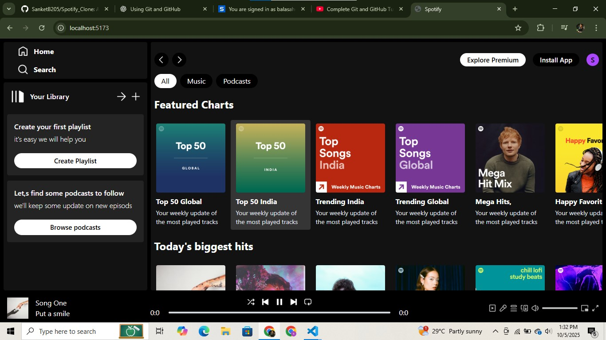
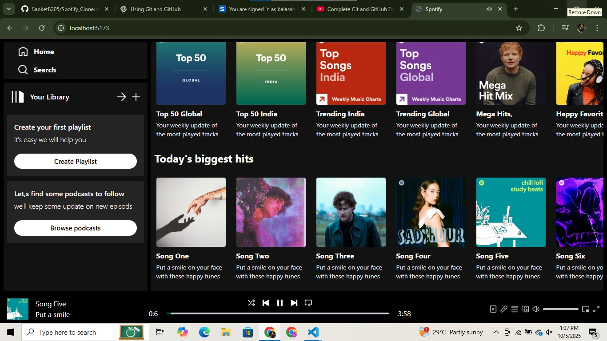
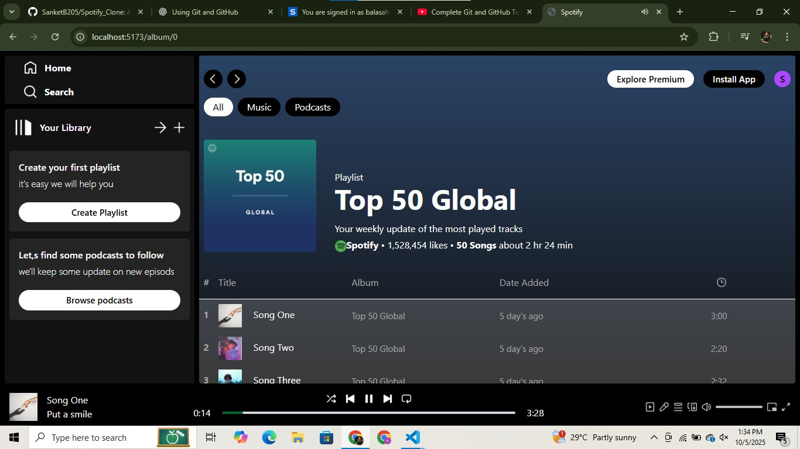
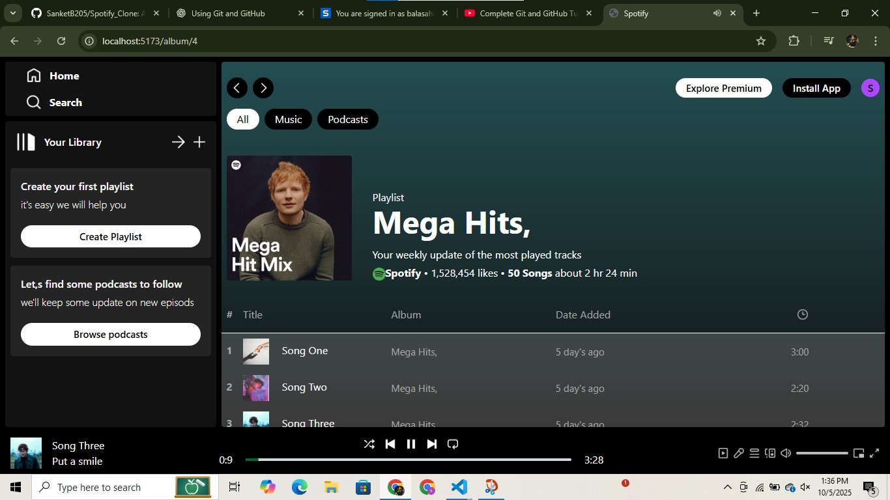

# 🎵 Spotify Clone
A Spotify Clone built with **React.js** and **Tailwind CSS** featuring a responsive UI, playlists, and a music player with controls. Designed to mimic Spotify’s interface, it demonstrates React components, hooks, and modern styling. Can be extended with APIs for real music data and streaming.

## 🚀 Features

* Responsive Spotify-like UI
* Sidebar navigation & playlists
* Music player with play/pause controls
* React components & hooks for state management
* Styled with Tailwind CSS for fast and modern design

## 🛠️ Tech Stack

* **React.js** – UI components & state management
* **Tailwind CSS** – Utility-first CSS framework
* **JavaScript (ES6+)**

## 📂 Installation & Setup

1. Clone the repository:

   ```bash
   git clone https://github.com/SanketB205/spotify-clone.git
   ```
2. Navigate to the project:

   ```bash
   cd spotify-clone
   ```
3. Install dependencies:

   ```bash
   npm install
   ```
4. Run the development server:

   ```bash
   npm start
   ```
5. Open [http://localhost:3000](http://localhost:3000) in your browser.

## 📸 Screenshots
### Home Page



### Album Section



## 🔮 Future Enhancements

* Integrate with **Spotify Web API** for real music data
* User authentication (Login with Spotify)
* Advanced playback features (next/previous, shuffle, repeat)

## 🤝 Contributing

Contributions are welcome! Feel free to fork this repo and submit pull requests.
